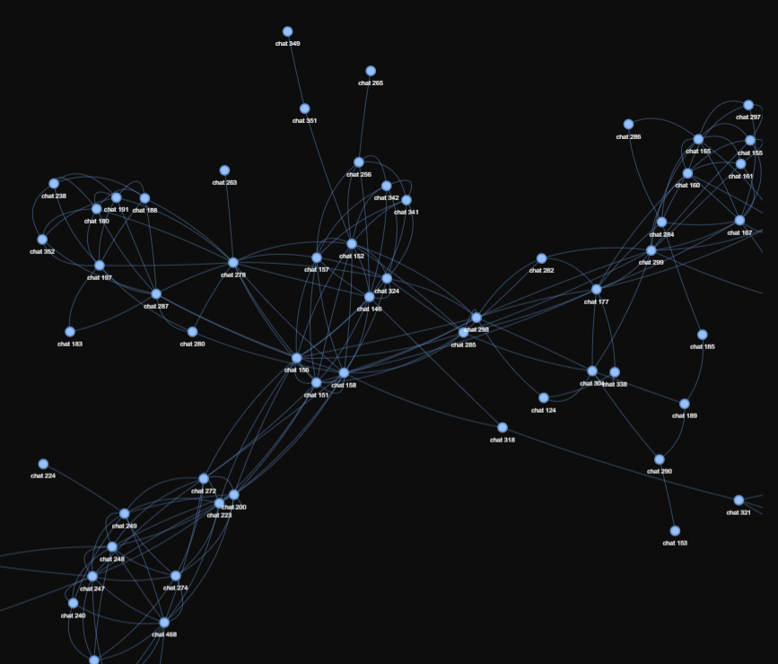
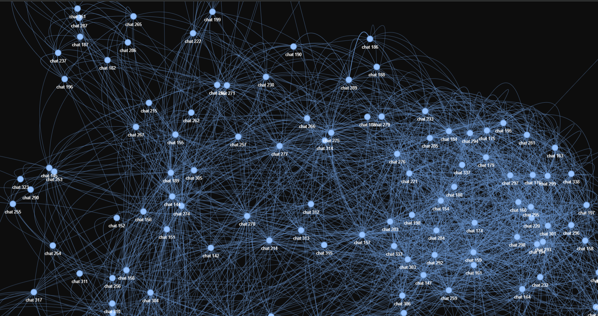

# 🌌 ChatGPT History Visualizer

<div align="center">

**Visualize your ChatGPT conversations as an interactive network graph using AI embeddings**

[](https://github.com/mohit1221iitian/chatgpt-history-visualizer/stargazers)
[](LICENSE)
[](https://www.python.org)

[🚀 Quick Start](#-quick-start) • [✨ Features](#-features) • [🎨 Gallery](#-see-it-in-action) • [🤝 Contribute](#-contributing)

</div>

---

## 🎯 What This Does

Ever wondered how your ChatGPT conversations relate to each other? This tool uses **AI embeddings** to find semantic similarities between your chats and visualizes them as a beautiful, interactive network graph.

- Each **node** = one conversation
- Each **connection** = semantic similarity between conversations
- **Closer nodes** = more similar topics/content

---

## ✨ Features

- 🤖 **AI-Powered Analysis** – Uses HuggingFace embeddings to understand conversation meaning
- 🕸️ **Network Visualization** – See how your conversations connect based on content similarity
- ⚡ **Interactive Graph** – Pan, zoom, drag nodes, and explore with physics controls
- 🎨 **Beautiful Dark Theme** – Sleek design with glowing nodes and smooth animations
- 🔒 **100% Local** – All processing happens on your machine, data stays private
- 📊 **Customizable Threshold** – Adjust similarity threshold to control connection density

---

## 🎨 See It In Action

<div align="center">


*Your conversations mapped by semantic similarity*


*Interactive network showing how topics connect*

</div>

---

## 🚀 Quick Start

### Prerequisites

- Python 3.8 or higher
- Your ChatGPT `conversations.json` file (export from ChatGPT settings)

### Installation

```bash
# 1️⃣ Clone the repository
git clone https://github.com/mohit1221iitian/chatgpt-history-visualizer.git
cd chatgpt-history-visualizer

# 2️⃣ Install dependencies
pip install -r requirements.txt

# 3️⃣ Add your conversations.json file to the project folder

# 4️⃣ Run the script
python chat_history_visualizer.py

# 5️⃣ Open the generated chat_history_graph.html in your browser
```

### Requirements

Create a `requirements.txt` file with:
```txt
langchain-huggingface
sentence-transformers
scikit-learn
networkx
pyvis
python-dotenv
```

---

## 🛠️ How It Works

```
1. Load conversations.json
         ↓
2. Extract user-assistant pairs
         ↓
3. Generate embeddings (HuggingFace)
         ↓
4. Calculate similarity matrix
         ↓
5. Create network graph (NetworkX)
         ↓
6. Visualize with PyVis
         ↓
7. Interactive HTML graph! 🎉
```

### Technical Details

- **Embeddings**: Uses `sentence-transformers/all-MiniLM-L6-v2` for fast, quality embeddings
- **Similarity**: Cosine similarity to measure conversation relationships
- **Threshold**: Default 0.6 (connections shown for >60% similarity)
- **Visualization**: PyVis creates interactive network with physics simulation
- **Graph Library**: NetworkX for graph data structure

---

## ⚙️ Customization

### Adjust Similarity Threshold

In `chat_history_visualizer.py`, change the threshold value:

```python
threshold = 0.6  # Lower = more connections, Higher = fewer connections
```

- **0.5-0.6**: More connections, denser graph
- **0.7-0.8**: Fewer connections, clearer clusters
- **0.9+**: Only very similar conversations connected

### Change Embedding Model

Swap for a different model:

```python
embedding_llm = HuggingFaceEmbeddings(
    model_name="BAAI/bge-large-en-v1.5"  # More powerful but slower
    # model_name="sentence-transformers/all-MiniLM-L6-v2"  # Default: fast and good
)
```

### Customize Graph Appearance

Modify PyVis settings:

```python
net = Network(
    height="1000px", 
    width="100%", 
    bgcolor="#0d0d0d",  # Background color
    font_color="white"   # Text color
)
```

---

## 🎯 Use Cases

- 📚 **Research** – Find related discussions across your chat history
- 🔍 **Discovery** – Uncover unexpected connections between topics
- 🧠 **Analysis** – Understand your conversation patterns and interests
- 🎨 **Visualization** – Create beautiful maps of your AI interactions
- 📊 **Exploration** – Navigate your chat history visually instead of scrolling

---

## 💡 Understanding Your Graph

### What the visualization shows:

- **Clusters** = groups of related conversations
- **Bridges** = conversations connecting different topics
- **Isolated nodes** = unique conversations with no strong similarities
- **Dense areas** = topics you discuss frequently

### Tips:

- Use the physics
